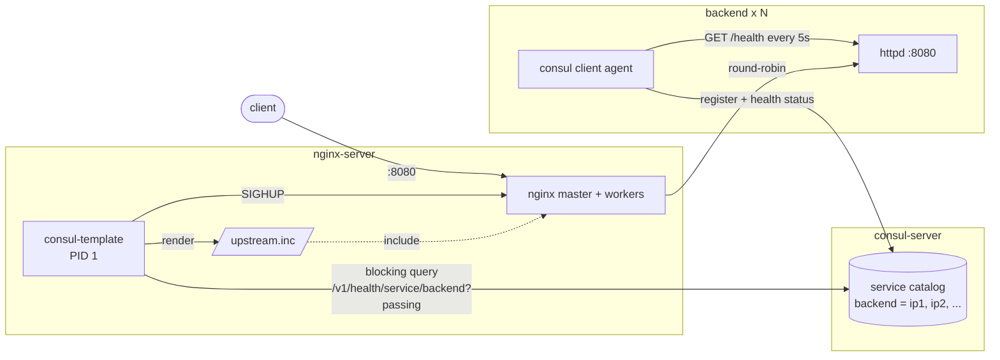

# nginx + Consul dynamic upstream demo

Scale the backend with `docker compose --scale` and nginx picks up the new
instances by itself: no config edits, no new nginx container, no nginx restart.

## Components

| Compose service | Image / build | Runs | Role |
|---|---|---|---|
| `consul-server` | `hashicorp/consul:1.19` | `consul agent -server` | Service registry. Holds the list of healthy `backend` instances. UI on http://localhost:8500 |
| `backend` (N replicas) | `./backend` | busybox `httpd` on `:8080` + Consul client agent | Serves `hello from <container> (<ip>)`. The agent registers the instance and runs its health check |
| `nginx-server` | `./nginx` | `consul-template` (PID 1) + `nginx` (child) | Load balancer on http://localhost:8080. consul-template keeps the nginx upstream in sync with Consul |

The nginx container has no Consul agent. consul-template only talks to the
Consul HTTP API on `consul-server:8500`.

## Architecture



## Flow: what happens on scale up

1. `docker compose up -d --scale backend=5` starts new `backend` containers.
2. Each new container starts `httpd`, then a Consul client agent
   (`backend/entrypoint.sh`). The agent joins `consul-server` and registers
   service `backend` with its container IP and port 8080 (`backend/backend.json`).
3. The agent checks `GET localhost:8080/health` every 5s. A new instance starts
   as `critical` and becomes `passing` after the first successful check, so it
   gets no traffic before it is ready.
4. consul-template holds a blocking query open on Consul for passing `backend`
   instances. Consul answers as soon as the list changes.
5. consul-template waits 1–3s for more changes (`wait` in
   `nginx/consul-template.hcl`), so a scale to 5 causes one reload, not five.
   Then it renders `nginx/upstream.ctmpl` to `/etc/nginx/conf.d/upstream.inc`:

   ```nginx
   upstream backend {
       zone backend 64k;
       server 172.22.0.4:8080;
       server 172.22.0.5:8080;
       ...
   }
   ```

6. consul-template sends `SIGHUP` to its nginx child (`reload_signal`). The
   nginx master stays up, re-reads the config and starts new workers. Old
   workers finish their in-flight requests and exit. No requests are dropped.

Scale down is the same in reverse. A stopped container's agent leaves the
cluster, the instance disappears from Consul, and nginx is reloaded without it.
If a container dies without leaving, its health check fails and Consul removes
it after 1 minute in `critical` (`deregister_critical_service_after`).

Design details:

- `zone backend 64k;` keeps round-robin state in shared memory. Without it,
  every nginx worker restarts its rotation after each reload and most requests
  go to the same backend.
- With no healthy backends, the template renders
  `server 127.0.0.1:65535 down;` so the nginx config stays valid. Requests then
  get 502.
- consul-template starts nginx only after the first render, so nginx never
  boots with a missing `upstream.inc`.
- Each response carries an `X-Upstream` header with the backend address.

## How to run

Requirements: Docker with the Compose plugin.

```sh
docker compose up -d --build --scale backend=3
curl -i localhost:8080
```

Scale and watch nginx follow:

```sh
docker compose up -d --scale backend=5
docker compose exec nginx-server cat /etc/nginx/conf.d/upstream.inc
docker compose logs -f nginx-server
```

Run the full scale 1 -> 5 -> 2 check. It prints the rendered upstream and the
spread of 20 requests at each step:

```sh
scripts/demo.sh            # SETTLE=<seconds> changes the wait per step (default 15)
```

Stop everything:

```sh
docker compose down
```
